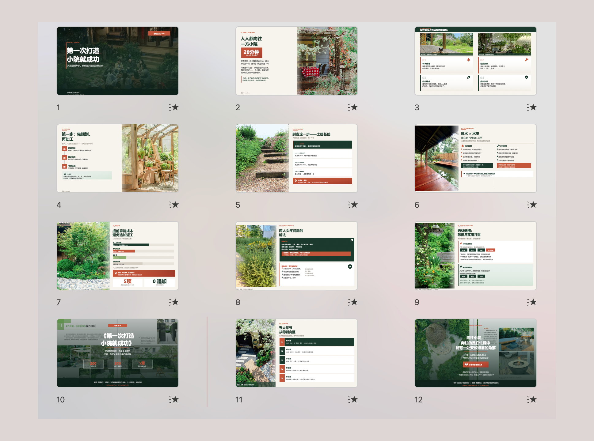
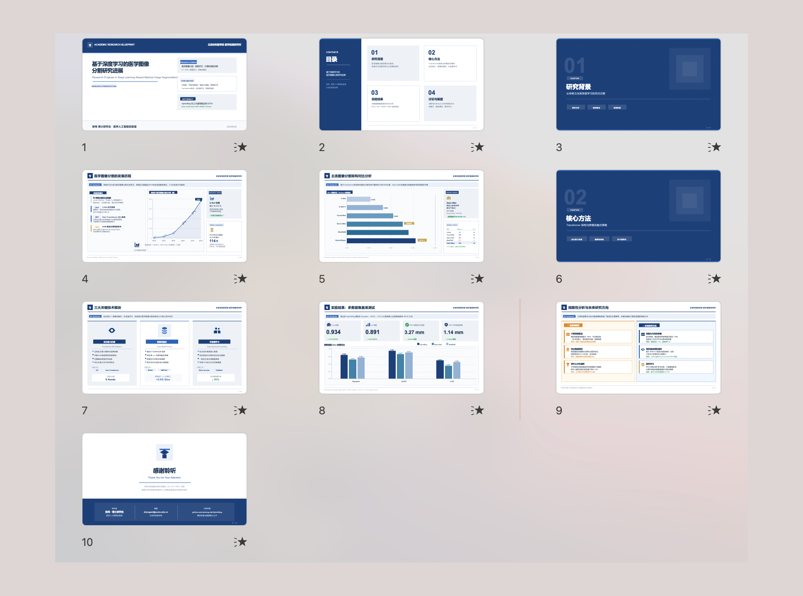
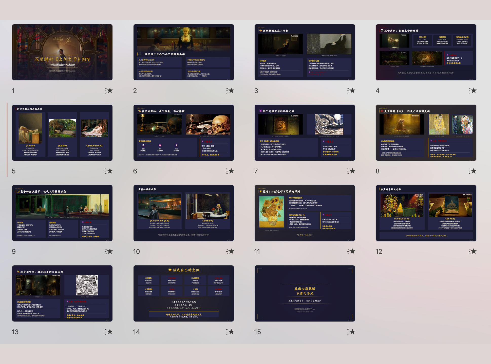
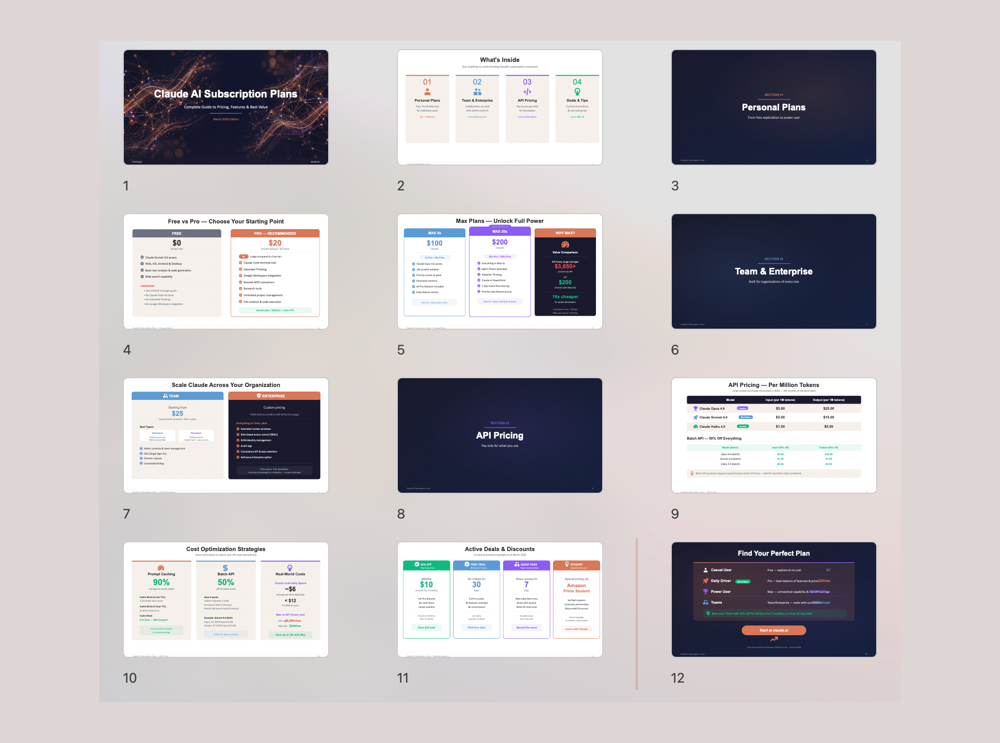

# PPT Master — AI generates natively editable PPTX from any document

[](https://github.com/hugohe3/ppt-master/releases)
[](https://opensource.org/licenses/MIT)
[](https://github.com/hugohe3/ppt-master/stargazers)
[](https://atomgit.com/hugohe3/ppt-master)

English | [中文](./README_CN.md)

<p align="center">
  <a href="https://hugohe3.github.io/ppt-master/"><strong>Live Demo</strong></a> ·
  <a href="https://www.hehugo.com/"><strong>About Hugo He</strong></a> ·
  <a href="./examples/"><strong>Examples</strong></a> ·
  <a href="./docs/faq.md"><strong>FAQ</strong></a> ·
  <a href="mailto:heyug3@gmail.com"><strong>Contact</strong></a>
</p>

> **Official channels —** this project is published **only** on [GitHub](https://github.com/hugohe3/ppt-master) (primary) and [AtomGit](https://atomgit.com/hugohe3/ppt-master) (auto-synced mirror). Redistributions on any other platform are unofficial and not maintained by the author. Licensed under MIT — attribution required.

---

Drop in a PDF, DOCX, URL, or Markdown — get back a **natively editable PowerPoint** with real shapes, real text boxes, and real charts. Not images. Click anything and edit it.

**[Why PPT Master?](./docs/why-ppt-master.md)**

There's no shortage of AI presentation tools — what's missing is one where the output is **actually usable as a real PowerPoint file**. I build presentations every day, but most tools export images or web screenshots: they look nice but you can't edit anything. Others produce bare-bones text boxes and bullet lists. And they all want a monthly subscription, upload your files to their servers, and lock you into their platform.

PPT Master is different:

- **Real PowerPoint** — if a file can't be opened and edited in PowerPoint, it shouldn't be called a PPT. Every element PPT Master outputs is directly clickable and editable
- **Transparent, predictable cost** — the tool is free and open source; the only cost is your own AI editor, and you know exactly what you're paying. As low as **$0.08/deck** with VS Code Copilot
- **Data stays local** — your files shouldn't have to be uploaded to someone else's server just to make a presentation. Apart from AI model communication, the entire pipeline runs on your machine
- **No platform lock-in** — your workflow shouldn't be held hostage by any single company. Works with Claude Code, Cursor, VS Code Copilot, and more; supports Claude, GPT, Gemini, Kimi, and other models

**[See live examples →](https://hugohe3.github.io/ppt-master/)** · [`examples/`](./examples/) — 15 projects, 229 pages

## Gallery

<table>
  <tr>
    <td align="center"><br/><sub><b>Magazine</b> — warm earthy tones, photo-rich layout</sub></td>
    <td align="center"><br/><sub><b>Academic</b> — structured research format, data-driven</sub></td>
  </tr>
  <tr>
    <td align="center"><br/><sub><b>Dark Art</b> — cinematic dark background, gallery aesthetic</sub></td>
    <td align="center"><br/><sub><b>Nature Documentary</b> — immersive photography, minimal UI</sub></td>
  </tr>
  <tr>
    <td align="center"><br/><sub><b>Tech / SaaS</b> — clean white cards, pricing table layout</sub></td>
    <td align="center"><br/><sub><b>Product Launch</b> — high contrast, bold specs highlight</sub></td>
  </tr>
</table>

---

## Built by Hugo He

I'm a finance professional (CPA · CPV · Consulting Engineer (Investment)) who got tired of spending hours on presentations that could be automated. So I built this.

PPT Master started from a simple frustration: existing AI slide tools export images, not editable shapes. As someone who reviews and edits hundreds of slides in investment and consulting work, that was unacceptable. I wanted real DrawingML — click on any element and change it, just like you built it by hand.

This project is my attempt to bridge the gap between **domain expertise** and **product engineering** — turning a complex professional pain point into an open-source tool that anyone can use.

🌐 [Personal website](https://www.hehugo.com/) · 📧 [heyug3@gmail.com](mailto:heyug3@gmail.com) · 🐙 [@hugohe3](https://github.com/hugohe3)

---

## Quick Start

### 1. Prerequisites

**You only need Python.** Everything else is installed via `pip install -r requirements.txt`.

| Dependency | Required? | What it does |
|------------|:---------:|--------------|
| [Python](https://www.python.org/downloads/) 3.10+ | ✅ **Yes** | Core runtime — the only thing you actually need to install |

> **TL;DR** — Install Python, run `pip install -r requirements.txt`, and you're ready to generate presentations.

<details open>
<summary><strong>Windows</strong> — see the dedicated step-by-step guide ⚠️</summary>

Windows requires a few extra steps (PATH setup, execution policy, etc.). We wrote a **step-by-step guide** specifically for Windows users:

**📖 [Windows Installation Guide](./docs/windows-installation.md)** — from zero to a working presentation in 10 minutes.

Quick version: download Python from [python.org](https://www.python.org/downloads/) → **check "Add to PATH"** during install → `pip install -r requirements.txt` → done.
</details>

<details>
<summary><strong>macOS / Linux</strong> — install and go</summary>

```bash
# macOS
brew install python
pip install -r requirements.txt

# Ubuntu / Debian
sudo apt install python3 python3-pip
pip install -r requirements.txt
```
</details>

<details>
<summary><strong>Edge-case fallbacks</strong> — 99% of users don't need these</summary>

Two external tools exist as fallbacks for edge cases. **Most users will never need them** — install only if you hit one of the specific scenarios below.

| Fallback | Install only if… |
|----------|-----------------|
| [Node.js](https://nodejs.org/) 18+ | You need to import WeChat Official Account articles **and** `curl_cffi` (part of `requirements.txt`) has no prebuilt wheel for your Python + OS + CPU combination. In normal setups `web_to_md.py` handles WeChat directly through `curl_cffi`. |
| [Pandoc](https://pandoc.org/) | You need to convert legacy formats: `.doc`, `.odt`, `.rtf`, `.tex`, `.rst`, `.org`, or `.typ`. `.docx`, `.html`, `.epub`, `.ipynb` are handled natively by Python — no pandoc required. |

```bash
# macOS (only if the above conditions apply)
brew install node
brew install pandoc

# Ubuntu / Debian
sudo apt install nodejs npm
sudo apt install pandoc
```
</details>

### 2. Pick an AI Editor

| Tool | Rating | Notes |
|------|:------:|-------|
| **[Claude Code](https://claude.ai/)** | ⭐⭐⭐ | Best results — native Opus, largest context |
| [Cursor](https://cursor.sh/) / [VS Code + Copilot](https://code.visualstudio.com/) | ⭐⭐ | Good alternatives |
| Codebuddy IDE | ⭐⭐ | Best for Chinese models (Kimi 2.5, MiniMax 2.7) |

### 3. Set Up

**Option A — Download ZIP** (no Git required): click **Code → Download ZIP** on the [GitHub page](https://github.com/hugohe3/ppt-master), then unzip.

**Option B — Git clone** (requires [Git](https://git-scm.com/downloads) installed):

```bash
git clone https://github.com/hugohe3/ppt-master.git
cd ppt-master
```

Then install dependencies:

```bash
pip install -r requirements.txt
```

To update later (Option B only): `python3 src/pptmaster/scripts/update_repo.py`

### 4. Create

**Provide source materials (recommended):** Place your PDF, DOCX, images, or other files in the `projects/` directory, then tell the AI chat panel which files to use. The quickest way to get the path: right-click the file in your file manager or IDE sidebar → **Copy Path** (or **Copy Relative Path**) and paste it directly into the chat.

```
You: Please create a PPT from projects/q3-report/sources/report.pdf
```

**Paste content directly:** You can also paste text content straight into the chat window and the AI will generate a PPT from it.

```
You: Please turn the following into a PPT: [paste your content here...]
```

Either way, the AI will first confirm the design spec:

```
AI:  Sure. Let's confirm the design spec:
     [Template] B) Free design
     [Format]   PPT 16:9
     [Pages]    8-10 pages
     ...
```

The AI handles everything — content analysis, visual design, SVG generation, and PPTX export.

> **Output:** Two timestamped files are saved to `exports/` — a native-shapes `.pptx` (directly editable) and an `_svg.pptx` snapshot for visual reference. Requires Office 2016+.

> **AI lost context?** Ask it to read the SKILL.md in the [ppt-master-skill](../ppt-master-skill) sibling repo.

> **Something went wrong?** Check the **[FAQ](./docs/faq.md)** — it covers model selection, layout issues, export problems, and more. Continuously updated from real user reports.

### 5. AI Image Generation (Optional)

```bash
cp .env.example .env    # then edit with your API key
```

```env
IMAGE_BACKEND=gemini                        # required — must be set explicitly
GEMINI_API_KEY=your-api-key
GEMINI_MODEL=gemini-3.1-flash-image-preview
```

Supported backends: `gemini` · `openai` · `qwen` · `zhipu` · `volcengine` · `stability` · `bfl` · `ideogram` · `siliconflow` · `fal` · `replicate`

Run `python3 src/pptmaster/scripts/image_gen.py --list-backends` to see tiers. Environment variables override `.env`. Use provider-specific keys (`GEMINI_API_KEY`, `OPENAI_API_KEY`, etc.) — global `IMAGE_API_KEY` is not supported.

> **Tip:** For best quality, generate images in [Gemini](https://gemini.google.com/) and select **Download full size**. Remove the watermark with `scripts/gemini_watermark_remover.py`.

---

## Documentation

| | Document | Description |
|---|----------|-------------|
| 🆚 | [Why PPT Master](./docs/why-ppt-master.md) | How it compares to Gamma, Copilot, and other AI tools |
| 🪟 | [Windows Installation](./docs/windows-installation.md) | Step-by-step setup guide for Windows users |
| 📖 | [SKILL.md](../ppt-master-skill/SKILL.md) | Core workflow and rules (skill repo) |
| 📐 | [Canvas Formats](../ppt-master-skill/references/canvas-formats.md) | PPT 16:9, Xiaohongshu, WeChat, and 10+ formats (skill repo) |
| 🛠️ | [Scripts & Tools](./src/pptmaster/scripts/README.md) | All scripts and commands |
| 💼 | [Examples](./examples/README.md) | 15 projects, 229 pages |
| 🏗️ | [Technical Design](./docs/technical-design.md) | Architecture, design philosophy, why SVG |
| ❓ | [FAQ](./docs/faq.md) | Model selection, cost, layout troubleshooting, custom templates |

---

## Contributing

See [CONTRIBUTING.md](./CONTRIBUTING.md) for how to get involved.

## License

[MIT](LICENSE)

## Acknowledgments

[SVG Repo](https://www.svgrepo.com/) · [Tabler Icons](https://github.com/tabler/tabler-icons) · [Robin Williams](https://en.wikipedia.org/wiki/Robin_Williams_(author)) (CRAP principles) · McKinsey, BCG, Bain

## Contact & Collaboration

Looking to collaborate, integrate PPT Master into your workflow, or just have questions?

- 💬 **Questions & sharing** — [GitHub Discussions](https://github.com/hugohe3/ppt-master/discussions)
- 🐛 **Bug reports & feature requests** — [GitHub Issues](https://github.com/hugohe3/ppt-master/issues)
- 📧 **Business & consulting inquiries** — [heyug3@gmail.com](mailto:heyug3@gmail.com)
- 🌐 **Learn more about the author** — [www.hehugo.com](https://www.hehugo.com/)

---

## Star History

If this project helps you, please give it a ⭐!

<a href="https://star-history.com/#hugohe3/ppt-master&Date">
 <picture>
   <source media="(prefers-color-scheme: dark)" srcset="https://api.star-history.com/svg?repos=hugohe3/ppt-master&type=Date&theme=dark" />
   <source media="(prefers-color-scheme: light)" srcset="https://api.star-history.com/svg?repos=hugohe3/ppt-master&type=Date" />
   
 </picture>
</a>

---

## Supported by DigitalOcean

<p>This project is supported by:</p>
<p>
  <a href="https://m.do.co/c/547f129aabe1">
    
  </a>
</p>

---

## Sponsor

If this project saves you time, consider buying me a coffee!

**PayPal**

<a href="https://paypal.me/hugohe3"></a>

**Alipay / 支付宝**


---

Made with ❤️ by [Hugo He](https://www.hehugo.com/)

[⬆ Back to Top](#ppt-master--ai-generates-natively-editable-pptx-from-any-document)
